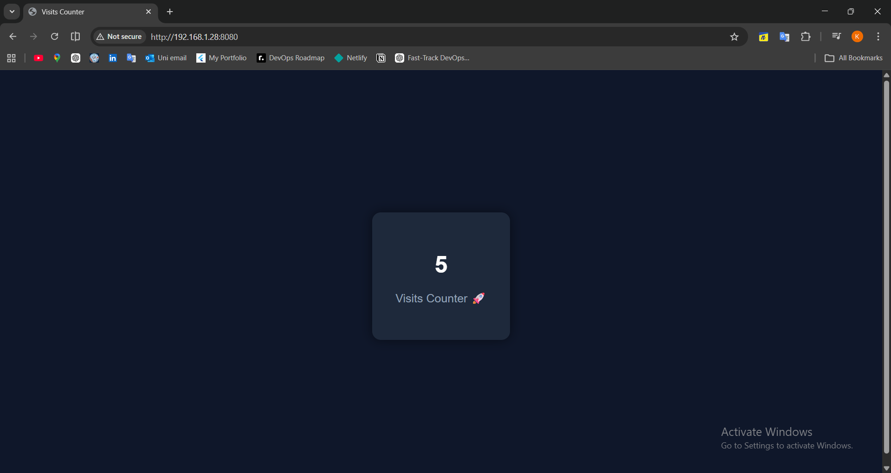
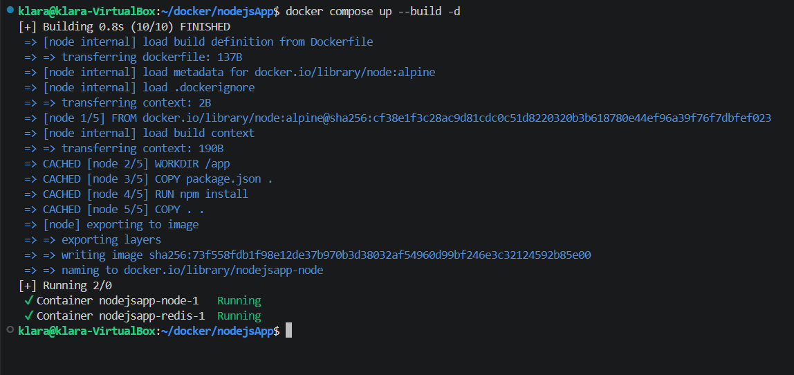

# 🚀 My DevOps Journey: Node.js + Redis Project

For the past period, I’ve been diving into the **DevOps field**, trying to understand how real systems work behind the scenes.  
Instead of only learning concepts, I decided to get hands-on and build small projects to see everything in action.  

This project is a **simple Node.js application** that is fully containerized with **Docker** and **Docker Compose**.

---

## 🌟 Features
- Uses **Redis** as a lightweight data store
- Containerized with **Docker**
- Multi-container orchestration with **Docker Compose**
- Practical debugging experience with real-world setup
- Increment a page visit counter on every page refresh
  
---

## 💡 What I Learned
- Running multi-container applications
- Connecting services inside containers
- Using Redis for lightweight storage
- Debugging real setup issues
- Practical experience with **Node.js**, **Redis**, and **Docker**

---

## 🛠 Tech Stack
- **Node.js**
- **Redis**
- **Docker**
- **Docker Compose**
- **Express.js**

---

## ⚡ How to Run

1. Clone the repo:
```bash
git clone git@github.com:klarasameh1/Containerized-Nodejs-app.git
````

2. Enter the project folder:

```bash
cd Containerized-Nodejs-app
```

3. Start the app using Docker Compose:

```bash
docker-compose up
```

4. Open your browser at `http://localhost:8080`

---

## 📸 Screenshots

**Web Interface:**


**Terminal / Docker Logs:**


> *Make sure your screenshots are in the repo root with these exact names.*

---

## 🤝 Contributing / Feedback

I’m still learning and would love **tips, advice, and feedback** from anyone experienced in DevOps!
If you have suggestions or improvements, feel free to **open an issue** or **submit a pull request**.

---

## 🔗 Links

* [GitHub Repository](https://github.com/klarasameh1/Containerized-Nodejs-app)

```

